# ActionPilot

**An LLM-powered Task Understanding and Action Planning Agent**

## 面向大学生复杂任务的智能行动规划 Agent

ActionPilot 是一个基于大语言模型（LLM）的任务理解与行动规划 Agent。

它面向课程作业、竞赛通知、科研项目申报等复杂任务场景，帮助用户从非结构化文档中提取关键要求，并自动生成可执行的任务计划。

用户只需要上传任务通知文件（PDF、DOCX、Markdown、TXT），ActionPilot 可以自动完成：

- 任务目标理解
- 截止日期提取
- 提交材料整理
- 关键要求分析
- 风险提醒
- 材料 Checklist 生成
- 阶段化行动计划生成

## Repository

GitHub 仓库地址：

[https://github.com/hxqxinqihuang/actionpilot](https://github.com/hxqxinqihuang/actionpilot)

---

## 1. 项目背景

在大学学习和科研过程中，学生经常需要面对大量复杂通知：

- 课程项目要求
- 创新创业比赛通知
- 科研项目申报指南
- 实验任务说明

这些文档通常包含多个时间节点、大量提交材料、隐含限制条件和复杂执行流程。用户往往需要人工阅读、整理材料清单、判断优先级并制定执行计划。

ActionPilot 希望利用大语言模型的理解能力，将复杂通知转换为结构化任务和行动方案，降低信息整理成本，帮助学生从“看懂要求”进一步走向“完成任务”。

---

## 2. 项目定位

ActionPilot 不是一个通用文档摘要工具，而是面向大学生复杂任务场景的 AI Action Planning Agent。

它重点解决的问题不是“把文档总结成几句话”，而是：

- 明确任务目标
- 找出关键截止日期
- 整理必须提交的材料
- 识别硬性要求和潜在风险
- 生成可执行的阶段计划
- 提醒用户下一步应该做什么

相比直接把文档丢给大模型总结，ActionPilot 更强调结构化、可验证和可执行。

---

## 3. 核心功能

### 3.1 多格式文档解析

支持：

- TXT
- Markdown
- DOCX
- PDF

系统自动解析上传文件内容，并进行后续任务理解。

### 3.2 智能任务抽取

利用大语言模型分析文档内容，自动提取：

- 截止日期：报名截止时间、材料提交时间、最终提交时间等。
- 提交材料：Demo、PPT、技术报告、代码、报名表等。
- 核心要求：功能要求、资格限制、提交规范等。
- 待确认问题：日期冲突、提交环节不明确、材料要求不完整等。

### 3.3 Checklist 生成

系统根据文档要求生成任务检查列表：

```text
□ 完成作品 Demo
□ 准备技术报告
□ 提交项目代码
□ 完成最终材料检查
```

帮助用户避免遗漏重要任务。

### 3.4 Agent Action Plan

ActionPilot 不仅总结文档内容，而是进一步生成执行计划。

根据任务周期自动选择规划方式：

- 短期任务：日级计划
- 中期任务：周级计划
- 长期任务：阶段计划 + Milestones + Next Actions

输出包括：

- Goal
- Current Focus
- Next Actions
- Phases
- Key Actions
- Deliverables
- Milestones
- Final Checklist

---

## 4. 相比直接使用大模型总结的优势

直接让大模型总结文档，通常只能得到一段自然语言摘要，存在以下问题：

- 截止日期可能被遗漏或混淆。
- 提交材料和参考资料容易混在一起。
- 前置技能、项目要求、最终材料之间边界不清。
- 用户仍然需要自己拆解任务和安排时间。
- 输出格式不稳定，难以持续跟踪执行状态。

ActionPilot 的改进点：

- 使用结构化 Schema 输出任务、截止日期、材料、要求和问题。
- 对关键字段进行 Pydantic 校验，减少格式漂移。
- 将材料转换为可勾选 Checklist。
- 将任务要求进一步转换为 Action Plan。
- 针对长文档提供 compact/core/emergency fallback，提高稳定性。
- 将长周期任务保持为阶段计划，同时给出 Current Focus 和 Next Actions。

---

## 5. 与参考产品的关系

课程参考中提到的 Product Hunt、Kimi、NotebookLM、OpenAI、DeepSeek 等产品，提供了不同方向的启发：

- Product Hunt 展示了真实产品如何围绕用户痛点设计功能。
- Kimi、NotebookLM 等工具擅长长文档阅读和问答。
- OpenAI、DeepSeek 等模型提供了强大的语言理解和推理能力。

ActionPilot 的定位与这些产品不同：

- 它不是通用聊天机器人。
- 它不是单纯的文档问答工具。
- 它也不是产品发现平台。

ActionPilot 聚焦在“学生任务通知 -> 可执行行动计划”这一垂直场景，目标是帮助用户完成课程作业、竞赛申报和科研项目任务。

---

## 6. 创新点

### 6.1 从文档理解到行动规划

项目不仅做信息抽取，还将抽取结果进一步转化为阶段计划、里程碑和下一步行动建议。

### 6.2 面向学生任务场景的结构化抽取

系统区分：

- prerequisites：完成任务需要的技能、工具、账号或知识。
- materials：最终需要准备或提交的材料。
- requirements：必须、建议或可选满足的规则。

这避免了把“API 使用能力”误识别为“提交材料”等常见问题。

### 6.3 自适应计划粒度

系统根据任务周期选择不同规划方式：

- 短周期任务生成日级计划。
- 中周期任务生成周级计划。
- 长周期任务生成阶段计划和里程碑。

### 6.4 材料驱动的执行拆解

Action Planner 会根据提交材料反推工作阶段，例如：

- 报名表
- PPT
- Demo
- 代码
- 效果验证报告

对应生成：

- 需求理解与方案设计
- 技术开发与模型调用
- Demo 实现
- 测试与用户反馈
- 材料整理与提交

### 6.5 稳定性设计

系统针对长文档和模型输出不稳定问题，设计了多级 fallback：

- normal mode
- compact mode
- core action mode
- emergency extraction mode

在保证结构化输出的同时，提高长比赛通知、复杂项目说明的处理成功率。

---

## 7. Agent Design

ActionPilot 采用多阶段 Agent Workflow，而不是简单地对文档进行摘要。

### 7.1 Extraction Agent

Extraction Agent 负责从非结构化任务通知中提取任务实体，包括任务目标、截止日期、提交材料、硬性要求、风险和待确认问题。

### 7.2 Validation Layer

Validation Layer 负责对模型输出进行结构化校验，包括日期状态、证据来源、材料分类和要求一致性检查，降低模型幻觉风险。

### 7.3 Checklist Agent

Checklist Agent 将提交材料转换为可追踪的任务清单，帮助用户记录材料准备进度，避免遗漏关键提交项。

### 7.4 Planning Agent

Planning Agent 根据任务周期、截止日期、提交材料、已完成状态和用户时间约束，生成日级、周级或阶段化行动计划。


---

## 8. 系统架构

整体架构如下：

```text
             User
              |
              v
      Streamlit Interface
              |
              v
      Document Parser
              |
              v
    LLM Task Extraction Agent
              |
              v
    Structured Task Schema
              |
    +---------+---------+
    |                   |
    v                   v
Checklist          Action Planner
                        |
                        v
                Execution Plan
```

---

## 9. 技术实现

ActionPilot is designed as an Agent workflow rather than a single prompt-based summarizer.

### Programming Language

- Python 3.11

### Framework

- Streamlit

### Large Language Model

当前默认使用：

- DeepSeek API

模型负责：

- 文档理解
- 信息抽取
- 任务规划

### Data Processing

- PDF parsing
- DOCX parsing
- Markdown/TXT processing

### Structured Output

使用结构化 JSON Schema：

- TaskExtractionResult
- ActionPlan

并通过 Pydantic 数据验证保证输出格式稳定。

---

## 10. Agent Workflow

完整流程：

```text
Upload Document
    |
    v
Parse Document
    |
    v
LLM Understanding
    |
    v
Extract Tasks
    |
    v
Generate Checklist
    |
    v
Generate Action Plan
    |
    v
User Execution
```

---

## 11. Project Demo

典型使用流程：

1. 上传课程、竞赛或项目通知。
2. 系统分析文档，输出 Deadline、Materials、Requirements。
3. 生成 Checklist 和 Action Plan。
4. 用户根据计划完成任务。

---

## 12. Installation

### Clone repository

```bash
git clone https://github.com/hxqxinqihuang/actionpilot.git
cd actionpilot
```

### Install dependencies

```bash
pip install -r requirements.txt
```

### Configure API Key

创建 `.env` 文件，参考 `.env.example` 配置环境变量：

```env
DEEPSEEK_API_KEY=your_api_key
```

也可以使用项目通用变量：

```env
ACTIONPILOT_API_KEY=your_api_key
ACTIONPILOT_BASE_URL=https://api.deepseek.com
ACTIONPILOT_MODEL=deepseek-v4-pro
```

### Run

```bash
streamlit run app.py
```

---

## 13. Example Applications

### Course Projects

分析课程设计要求和大作业通知，生成开发计划与提交清单。

### Competition Registration

分析比赛通知和申报指南，生成时间安排与材料准备计划。

### Research Projects

分析项目申请要求和研究任务说明，生成阶段目标与工作安排。

---

## 14. Course Project Requirement Mapping

本项目对应课程要求如下：

- 大模型或 Agent 应用：ActionPilot 是面向复杂任务执行的 LLM Agent。
- API 调用：系统通过 OpenAI-compatible Provider 调用 DeepSeek API。
- 实用性：面向课程作业、竞赛申报、科研项目等真实学生场景。
- 可展示性：提供 Streamlit 页面，可上传文档、查看结构化分析和行动计划。
- 开源要求：代码已开源在 GitHub。
- README 要求：项目说明、运行方式、截图和功能介绍均已写入 README。

---

## 15. Demo Screenshots

以下截图展示了 ActionPilot 从输入文档、结构化分析到行动计划生成的完整流程。

### 15.1 输入与文件解析

用户可以直接粘贴任务通知，也可以上传 PDF、DOCX、Markdown 或 TXT 文件。

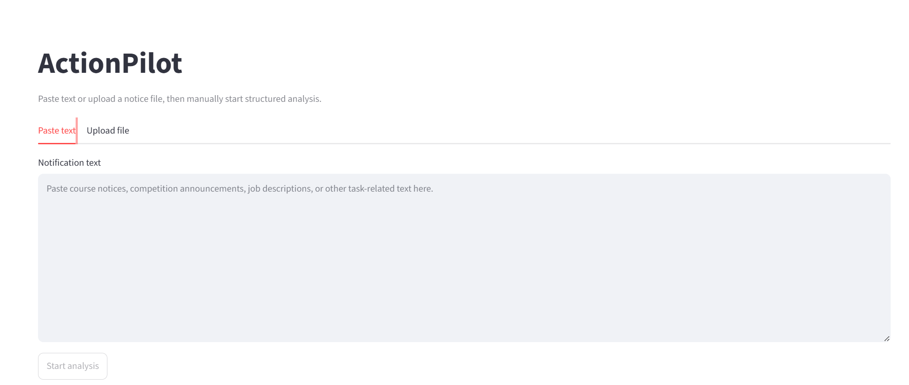

上传文件后，系统会展示文件名、文件类型、字符数、PDF 页数和文本预览入口。

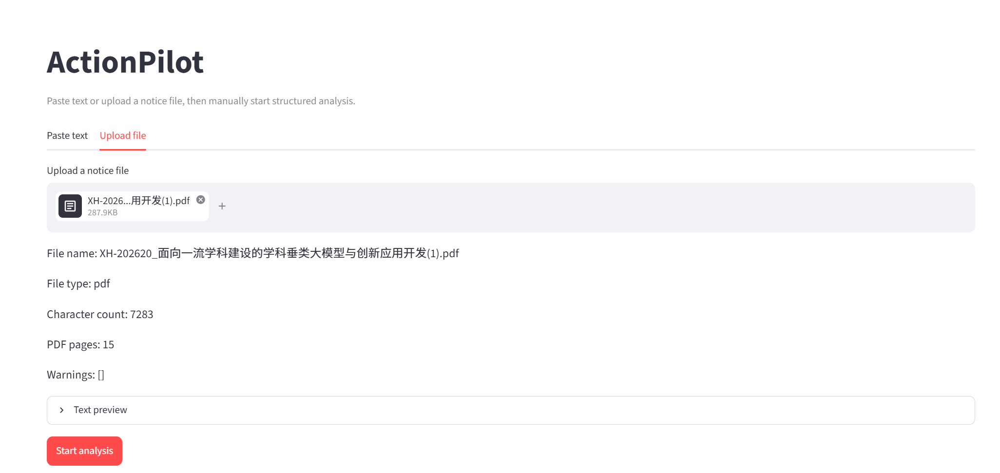

### 15.2 任务理解结果

ActionPilot 会先识别任务主题、摘要、置信度和输入语言。

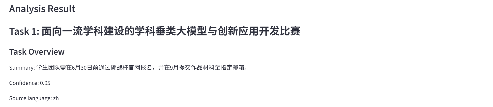

随后提取关键截止日期，并保留原文证据、归一化日期和验证状态。

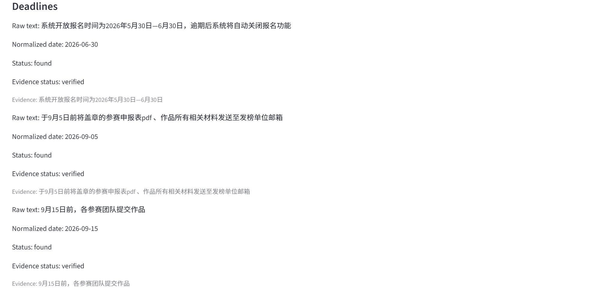

### 15.3 提交材料与硬性要求

系统根据通知内容生成材料检查清单，并显示完成进度。

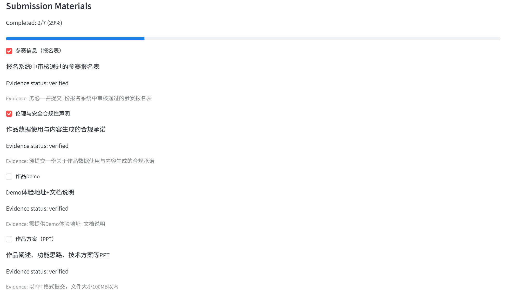

同时提取必须满足的核心要求，例如参赛资格、功能要求、提交规范等。

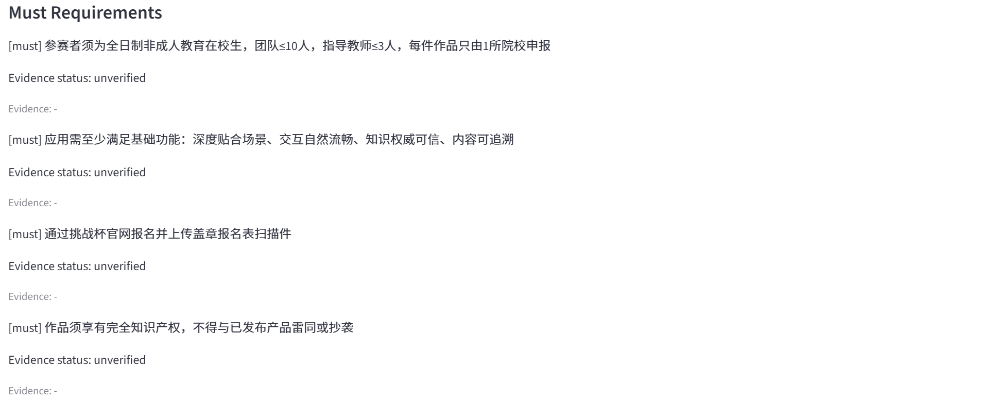

对于存在冲突、缺失或不确定的信息，系统会给出风险提示和待确认问题。

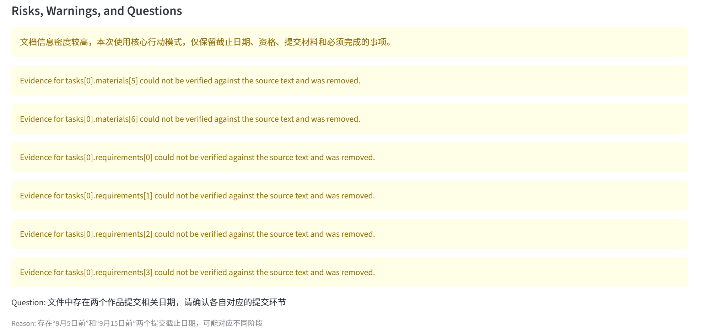

### 15.4 行动计划生成

用户可以设置计划开始日期、目标截止日期、每日可投入时间、每周投入天数和最终检查缓冲。

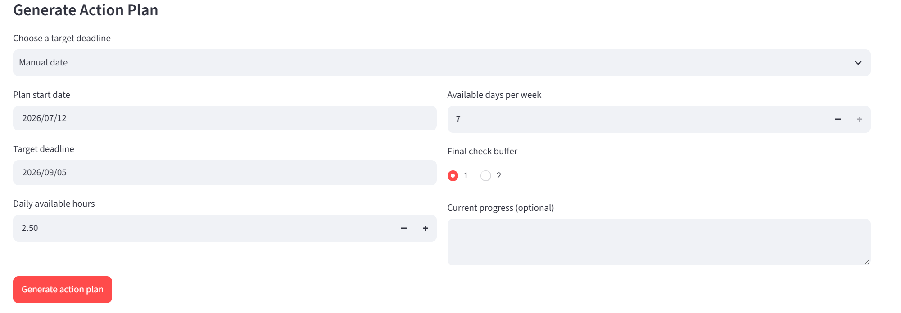

生成后，ActionPilot 会给出任务目标、计划类型、当前阶段和近期行动建议。


系统还会列出规划假设和风险提醒，帮助用户理解计划边界。

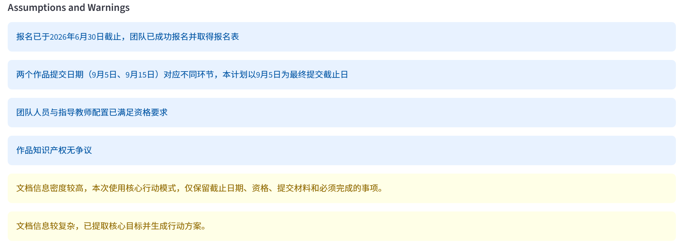

### 15.5 阶段计划、里程碑与最终检查

对于长周期竞赛或项目，ActionPilot 会生成阶段计划，而不是强行拆成每日任务。


每个阶段会对应关键里程碑，用于跟踪执行进度。

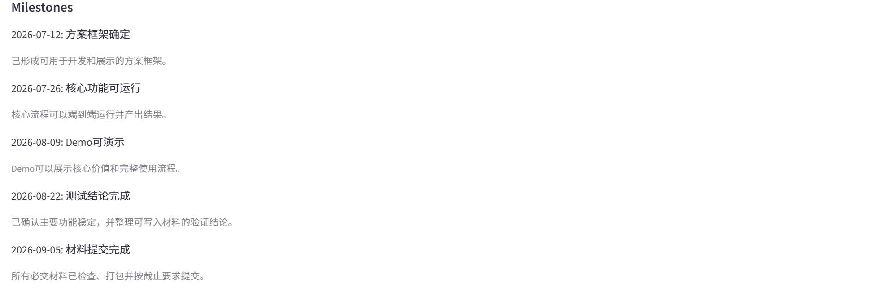

最后，系统会根据提交材料生成最终检查清单，辅助用户完成提交前核对。

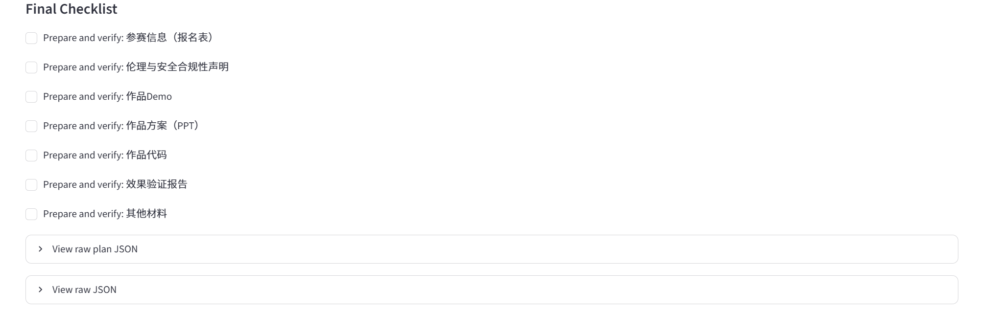

---

## 16. Future Improvements

未来可以扩展：

- 更多大模型支持（Qwen、Kimi、智谱等）
- 用户历史任务管理
- OCR 支持扫描文档
- 多任务管理
- 个性化规划策略
- 日历提醒或导出功能

---

## 17. License

This project is developed for educational purposes.
